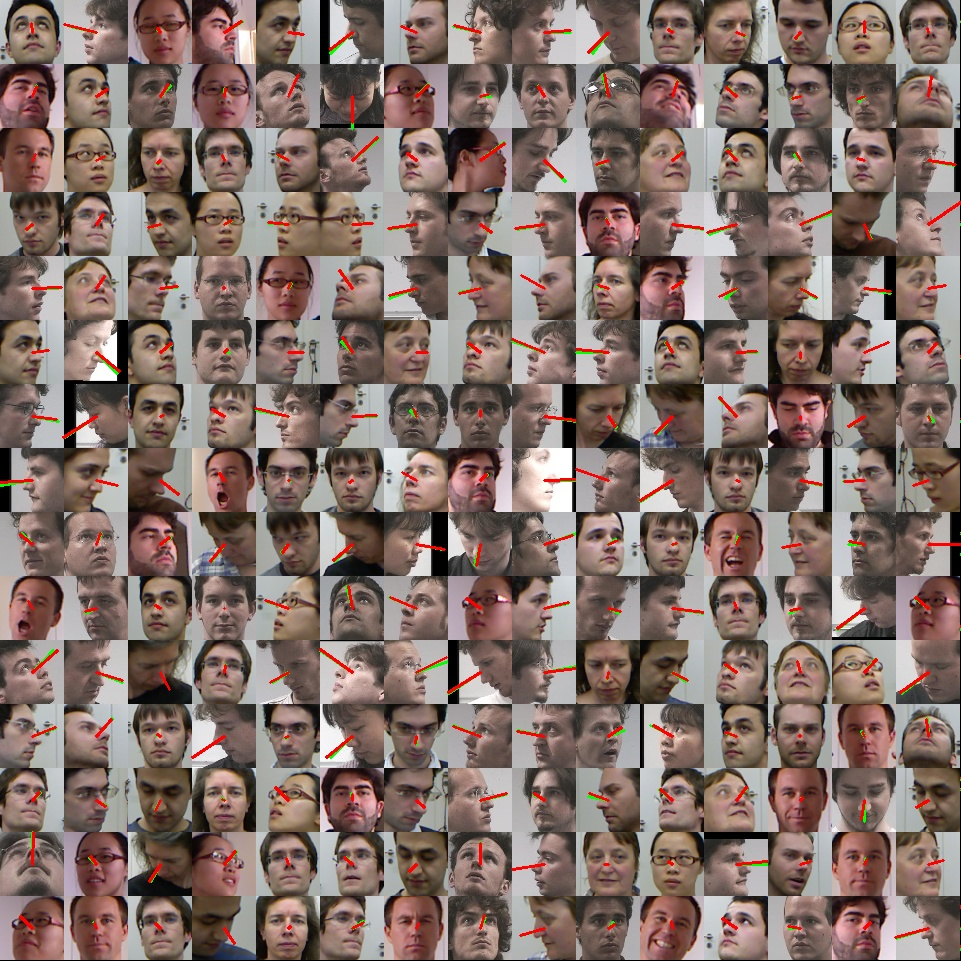

# CNN based head pose estimator

## About
    This is a python/mxnet implementation of a very simple CNN that predicts the head pose
    num of params < 100K
## Requirement
-opencv
-mxnet
-mtcnn
    I use https://github.com/pangyupo/mxnet_mtcnn_face_detection to do face cropping and alignment
## Test
run:
``python main.py``
examples from validation set:

